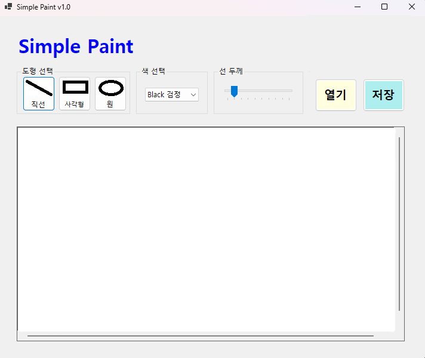
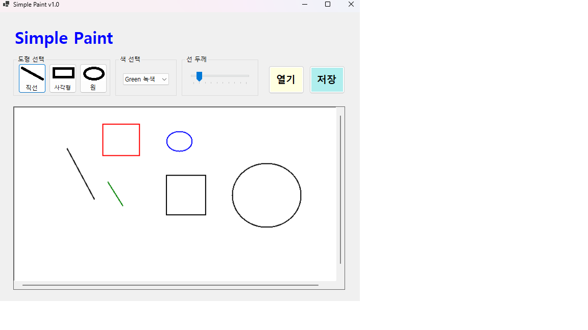
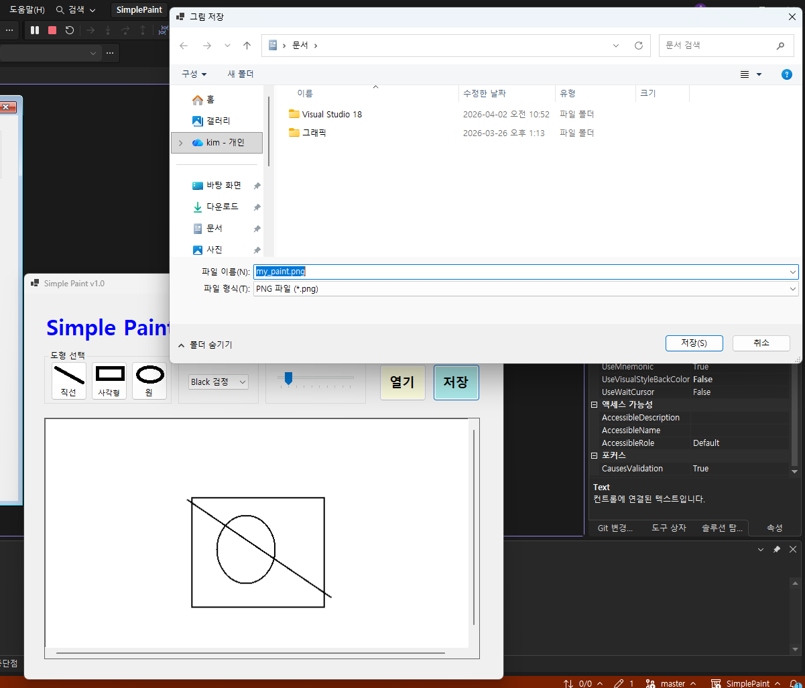
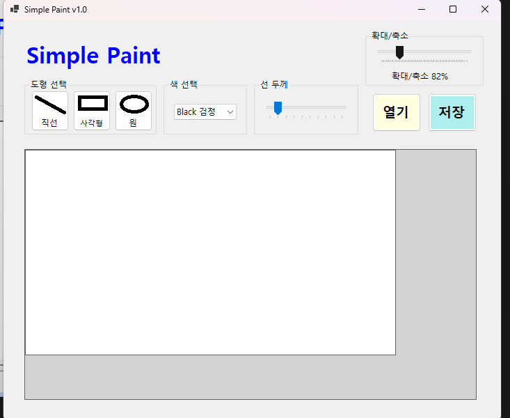

# (C# 코딩) SimplePaint

## 개요
- C# 프로그래밍 학습
- 1줄 소개: 사용자가 도형을 그리고 외부 이미지를 불러와 그 위에 그림을 그린 뒤 다양한 형식으로 저장할 수 있는 Windows Forms 기반 그림판 프로그램
- 사용한 플랫폼:
  - C#, .NET Windows Forms, Visual Studio, GitHub
- 사용한 컨트롤:
  - 입력: Button (도형 선택, 열기, 저장), ComboBox (색상 선택), TrackBar (선 두께, 확대/축소)
  - 출력: PictureBox (그림 표시), Label (프로그램 이름 및 확대 상태 표시)
  - 컨테이너: GroupBox (기능 구분), Panel (스크롤 가능한 캔버스 영역)
- 사용한 기술과 구현한 기능:
  - Bitmap 기반 캔버스 생성 및 관리
  - Graphics 객체를 이용한 도형 그리기
  - 마우스 이벤트 기반 드래그 처리
  - 이미지 파일 저장 및 불러오기
  - 확대/축소 기능 및 좌표 변환 처리
  - 스크롤 가능한 UI 구성

---

## 실행 화면 (과제1)

- 과제 내용
과제1의 목표는 SimplePaint 프로그램의 기본적인 사용자 인터페이스를 구성하고, 도형 선택, 색상 선택, 선 두께 선택과 같은 기본 입력 기능을 구현하는 것이다. 사용자가 직관적으로 기능을 사용할 수 있도록 화면을 구성하고 각 컨트롤의 역할을 명확하게 구분하는 것이 핵심이다. 또한 이후 단계에서 그림을 그리는 기능을 추가할 수 있도록 캔버스 영역을 미리 준비하는 것도 중요한 목표이다.

- 구현한 내용과 기능 설명
프로그램 상단에는 Label을 배치하여 애플리케이션 이름을 표시하였다. 화면 구성은 GroupBox를 활용하여 기능별로 영역을 나누었으며, 도형 선택 영역에는 직선, 사각형, 원을 선택할 수 있는 버튼을 배치하였다. 각 버튼에는 Click 이벤트를 연결하여 사용자가 선택한 도형이 내부 변수(currentTool)에 반영되도록 구현하였다.

색상 선택은 ComboBox를 이용하여 구현하였으며, Black, Red, Blue, Green 총 4가지 색상을 제공하였다. 사용자가 항목을 선택하면 SelectedIndexChanged 이벤트를 통해 현재 색상(currentColor)이 변경되도록 처리하였다.

선 두께는 TrackBar를 이용하여 구현하였으며, 최소값 1부터 최대값 10까지 설정하여 사용자가 직관적으로 선 굵기를 조절할 수 있도록 하였다. TrackBar 값이 변경될 때마다 현재 선 두께(currentLineWidth)가 갱신되도록 구현하였다.

또한 PictureBox를 캔버스 영역으로 배치하여 이후 과제에서 실제 그림을 그릴 수 있도록 준비하였다. 전체적으로 UI 구성과 기본 선택 기능이 정상적으로 동작하도록 구현하였다.

---

## 실행 화면 (과제2)

- 과제 내용
과제2의 목표는 마우스 드래그를 이용하여 PictureBox 캔버스 위에 직선, 사각형, 원을 그리는 기능을 구현하는 것이다. 사용자가 마우스를 누른 위치부터 이동한 위치까지를 기준으로 도형을 생성하며, 드래그 중에는 도형의 형태를 미리 확인할 수 있도록 점선 미리보기 기능을 제공하는 것이 핵심이다.

- 구현한 내용과 기능 설명
먼저 Bitmap 객체를 생성하여 실제 그림이 저장되는 캔버스를 구성하였다. 이 Bitmap은 화면이 아닌 메모리에 존재하는 이미지로, 사용자가 그린 모든 도형이 이 객체에 저장된다. Graphics 객체는 Graphics.FromImage를 통해 생성하여 Bitmap 위에 도형을 그릴 수 있도록 하였다.

MouseDown 이벤트에서는 사용자가 마우스를 누른 위치를 시작 좌표(startPoint)로 저장하고, 드래그 상태(isDrawing)를 true로 설정하였다. MouseMove 이벤트에서는 드래그 상태일 경우 현재 마우스 위치를 계속 갱신하며 Invalidate를 호출하여 화면을 다시 그리도록 처리하였다.

MouseUp 이벤트에서는 드래그를 종료하고 시작 좌표와 끝 좌표를 기준으로 선택된 도형을 Bitmap에 확정적으로 그리도록 구현하였다. 이 과정에서 Pen 객체를 사용하여 색상과 선 두께를 반영하였다.

또한 Paint 이벤트를 활용하여 드래그 중인 상태에서는 점선(DashStyle)을 적용한 Pen으로 도형을 미리 보여주도록 구현하였다. 이를 통해 사용자는 도형의 위치와 크기를 실시간으로 확인할 수 있다.

---

## 실행 화면 (과제3)

- 과제 내용
과제3의 목표는 사용자가 캔버스에 그린 그림을 이미지 파일로 저장할 수 있는 기능을 구현하는 것이다. 사용자가 저장 버튼을 클릭하면 파일 저장 대화상자가 실행되고, 원하는 위치와 파일 이름을 선택하여 다양한 이미지 형식으로 저장할 수 있도록 하는 것이 핵심이다.

- 구현한 내용과 기능 설명
SaveFileDialog를 사용하여 파일 저장 기능을 구현하였다. Filter 속성을 설정하여 PNG, JPG, BMP 세 가지 형식 중 하나를 선택할 수 있도록 하였으며, 기본 파일 이름을 설정하여 사용자 편의성을 높였다.

사용자가 파일을 선택하면 파일 확장자를 확인하여 해당 형식에 맞는 ImageFormat으로 저장하도록 구현하였다. 예를 들어 .jpg 파일은 ImageFormat.Jpeg로 저장되고, .bmp 파일은 ImageFormat.Bmp로 저장되도록 처리하였다. 그 외의 경우에는 기본적으로 PNG 형식으로 저장되도록 구성하였다.

중요한 점은 PictureBox 자체를 저장하는 것이 아니라 실제 그림 데이터가 저장된 Bitmap 객체를 저장한다는 것이다. 이를 통해 사용자가 그린 도형과 색상, 선 두께 정보가 그대로 이미지 파일에 반영되도록 하였다.

---

## 실행 화면 (과제4)

- 과제 내용
과제4의 목표는 외부 이미지 파일을 불러와 해당 이미지를 캔버스로 사용하고, 그 위에 도형을 그린 뒤 다시 이미지 파일로 저장할 수 있도록 기능을 확장하는 것이다. 또한 이미지 크기가 클 경우 스크롤 기능을 제공하고, 확대/축소 기능을 추가하여 사용자 편의성을 높이는 것이 핵심이다.

- 구현한 내용과 기능 설명
OpenFileDialog를 사용하여 외부 이미지 파일을 불러오는 기능을 구현하였다. PNG, JPG, JPEG, BMP 형식을 지원하도록 설정하였으며, 사용자가 선택한 이미지를 Bitmap 객체로 변환하여 기존 캔버스를 대체하도록 구성하였다.

이미지 크기가 클 경우 화면을 벗어나는 문제를 해결하기 위해 PictureBox를 Panel 내부에 배치하고 Panel의 AutoScroll 속성을 true로 설정하였다. 이를 통해 사용자는 스크롤바를 이용하여 이미지의 다양한 영역을 탐색할 수 있다.

확대/축소 기능은 TrackBar를 이용하여 구현하였다. 사용자가 TrackBar를 움직이면 확대 비율이 변경되고, PictureBox의 크기를 Bitmap 크기와 비율에 맞게 조정하도록 하였다. 확대/축소 상태에서도 정확한 위치에 그림이 그려지도록 마우스 좌표를 실제 Bitmap 좌표로 변환하는 로직을 추가하였다.

또한 불러온 이미지 위에 기존 도형 그리기 기능을 그대로 사용할 수 있도록 구현하였으며, 최종적으로 수정된 이미지를 PNG, JPG, BMP 형식으로 저장할 수 있도록 완성하였다.